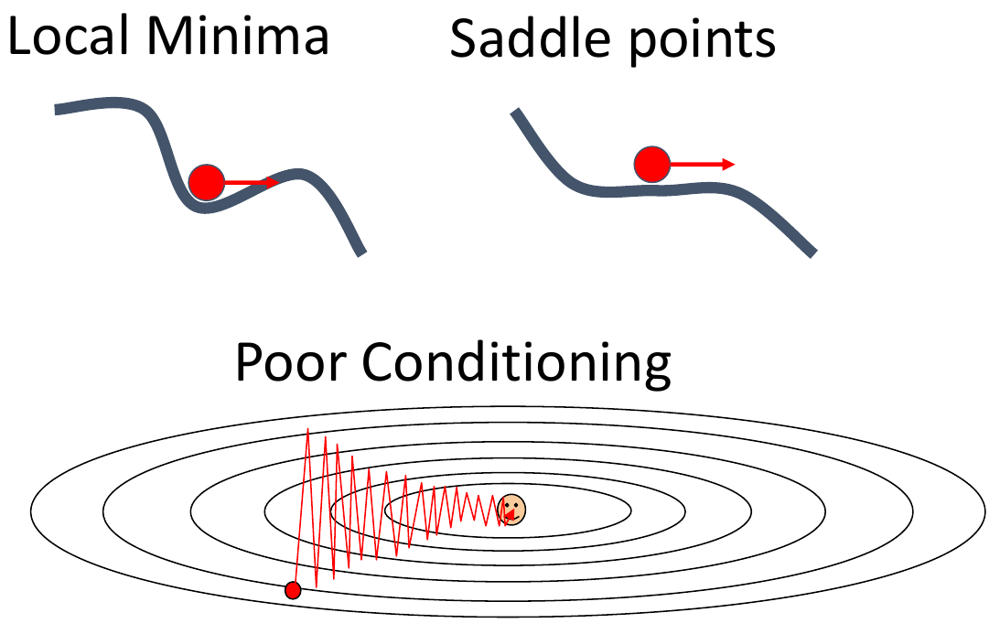
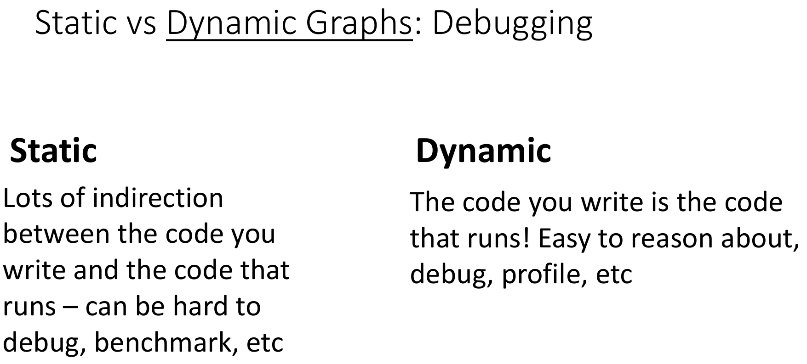
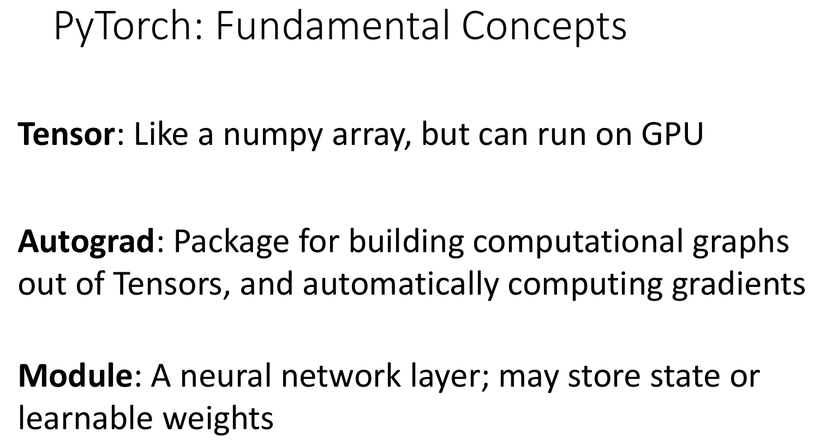
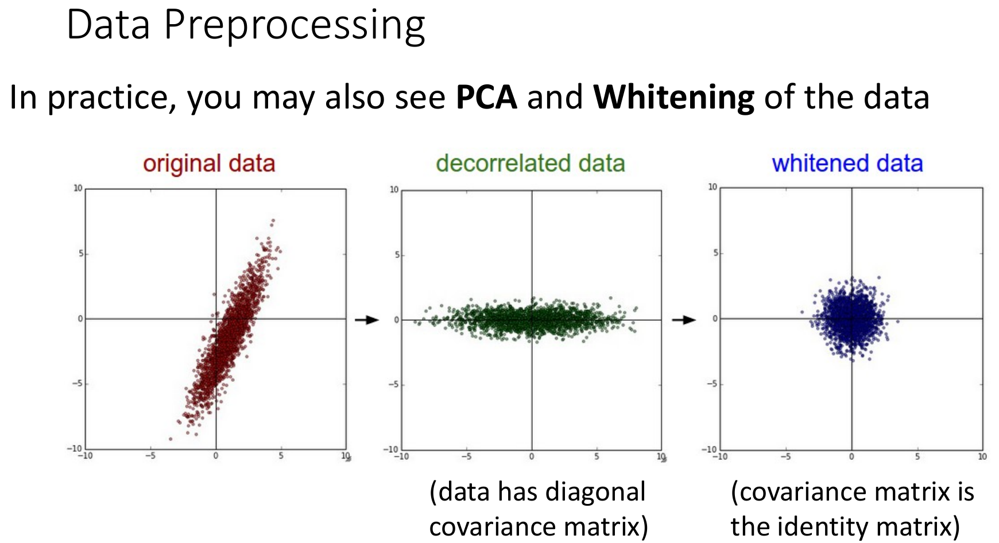

# 线性分类器（Linear Classifiers）

线性分类器的缺点


解决方法之一：**特征变换**


## 损失函数

损失函数定量描述模型的好坏，它代表了我们对于模型中参数的偏好。可能有两组参数的损失值相同，仅由数据计算而来的损失函数会认为两者相同。可以在损失函数中加入正则项来体现出人类的先验的对参数的偏好。

# 优化（Optimization）

$$
w^{*}=\operatorname{a r g} \operatorname* {m i n}_{w} L ( w )
$$

## SGD

对 gradient descent 进行 Stochastic 处理，每次迭代时候抽取一批样本而不是用全部样本用于参数更新来降低算力要求。

$$
x_{t+1}=x_{t}-\alpha\nabla f ( x_{t} )
$$

```python
for t in range(num_steps):
    dw = compute_gradient(w)
    w -= learning_rate * dw
```

### 问题



## SGD with Momentum

SGD with Momentum 是为了克服 SGD 在收敛的过程中可能会停在 **局部最小值** 或者 **鞍点** 的问题，在这些点处梯度为 0，参数无法继续更新。

通过给 SGD 一个速度，从而越过**局部最小值** 或者 **鞍点** 可以解决这些问题。


$$
\begin{aligned}
v_{t+1} &= \rho v_{t} + \nabla f ( x_{t} ) \\
x_{t+1} &= x_{t} - \alpha v_{t+1}
\end{aligned}
$$

```python
v = 0
for t in range(num_steps):
    dw = compute_gradient(w)
    v = rho * v + dw
    w -= learning_rate * v
```

Build up "velocity" as a running mean of gradients. Rho gives"friction";typically rho=0.9 or 0.99

等价于

$$
\begin{aligned}
  v_{t+1} &= \rho v_{t}-\alpha\nabla f ( x_{t} ) \\
  x_{t+1} &= x_{t}+v_{t+1}
\end{aligned}
$$

```python
v = 0  # 初始化动量项
for t in range(num_steps):  # 迭代 num_steps 次
    dw = compute_gradient(w)  # 计算当前权重 w 的梯度
    v = rho * v - learning_rate * dw  # 计算新的动量值
    w += v  # 更新权重
```

## Nesterov Momentum

根据速度向量到达新的点后计算梯度，对这个梯度和原来的速度进行向量和，作为原来的点更新使用的梯度。


$$
\begin{array} {l} {v_{t+1}=\rho v_{t}-\alpha\nabla f ( x_{t}+\rho v_{t} )} \\ {x_{t+1}=x_{t}+v_{t+1}} \\ \end{array}
$$

```python
V = 0  # 初始化动量
for t in range(num_steps):
    dw = compute_gradient(w)  # 计算梯度
    old_v = V  # 记录旧的动量
    V = rho * V - learning_rate * dw  # 更新动量
    w -= rho * old_v - (1 + rho) * V  # 更新权重
```

## AdaGrad 算法（Adaptive Gradient Algorithm）

沿着“陡峭”方向的进展受到抑制，而沿着“平坦”方向的进展被加速。


```python
grad_squared = 0  # 初始化梯度累积项
for t in range(num_steps):
    dw = compute_gradient(w)  # 计算梯度
    grad_squared += dw * dw  # 累积梯度平方
    w -= learning_rate * dw / (grad_squared.sqrt() + 1e-7)  # 进行参数更新，避免除零

```

问题：grad_squared 可能会在到达损失函数最低点过大，而使得参数停止更新。
解决方法：**RMSProp**。

## RMSProp

与 AdaGrad 算法相比增加了一个“摩擦”项。

```python
grad_squared = 0  # 初始化累积梯度平方项
for t in range(num_steps):
    dw = compute_gradient(w)  # 计算梯度
    grad_squared = decay_rate * grad_squared + (1 - decay_rate) * dw * dw  # 计算加权移动平均
    w -= learning_rate * dw / (grad_squared.sqrt() + 1e-7)  # 更新参数

```

## Adam 算法

结合两个好的 idea: SGD with Momentum + RMSProp = Adam
但是刚开始的时候梯度可能过大。
优化：**偏差修正**。

```python
moment1 = 0  # 一阶矩估计（动量项）
moment2 = 0  # 二阶矩估计（梯度平方的指数加权平均）

for t in range(num_steps):
    dw = compute_gradient(w)  # 计算梯度

    # 计算一阶矩估计（动量）
    moment1 = beta1 * moment1 + (1 - beta1) * dw

    # 计算二阶矩估计（梯度平方的移动平均）
    moment2 = beta2 * moment2 + (1 - beta2) * dw * dw

    # 计算一阶和二阶矩的偏差修正
    moment1_unbias = moment1 / (1 - beta1 ** t)
    moment2_unbias = moment2 / (1 - beta2 ** t)

    # 更新参数
    w -= learning_rate * moment1_unbias / (moment2_unbias.sqrt() + 1e-7)

```

### 经验

> Adam with beta1 = 0.9
> beta2 = 0.999, and learning rate = 1e-3, 5e-4, 1e-4 is a great starting point for many models!

# 神经网络

## 特征变换

通过对原始的输入特征进行变换，可能就能够处理原来的模型所不能处理的问题。对于图像分类而言，常用的特征变换包括：

-   Color Histogram 色彩直方图
-   Histogram of Oriented Gradients (HoG) 方向梯度直方图 (HoG)
-   Bag of Words 词袋模型 **_数据驱动的_**

不同的特征变换可以组合在一起使用。


## 端到端的学习

先进行特征提取再利用模型在提取出的特征上对图像进行分类时候，只会调整模型的参数，而特征提取的部分可能不会提高图片的分类效果。
因此，更好的办法是端到端的学习，输入原始数据，输出想要的结果。中间整体地对特征提取和特征处理部分进行训练来提高图像分类效果。

## 基础概念

深度神经网络的层数通常是指网络所含权重矩阵的个数。
宽度是隐藏表示的纬度。隐藏表示的纬度通常是一样的。
激活函数可以看成两个权重矩阵之间的“三明治”，给予网络额外的表现能力。

激活函数有多种。


通常应该使用某种可调正则化参数的神经网络模型，而不是直接依赖网络本身的大小作为正则化因子。
网络大小不一定是最优正则化方式：虽然较大的网络可能更容易过拟合，但仅仅减少参数数量并不总是最佳策略。

## 反向传播


pytorch 中模型的计算步骤存储在**计算图**中，每个节点代表一次运算。
反向传播中，对于计算图中每个节点来说 downstream gradient = upstream gradient \* local gradient
在代码中：正向传播与反向传播的代码通常一一对应，但是顺序相反。

# 卷积网络

卷积网络中的权重矩阵一般称为 **卷积核** 或者 **filter**，它的深度一般和输入张量的深度一致，比如说 3。
输入张量和卷积核卷积后的结果被称为 **activation map**。
一层卷积层可以有多个卷积核，这是一个 可以设置的超参数。卷积核的个数等于**输出中的通道数**。


有两种方式看待卷积后的结果：

1. 一系列的 feature map 的集合。
2. 特征向量组成的网格。

通常对一批图像进行处理。


> 一般可以对第一层的参数可视化进行解释。

## 步幅和填充

padding: 在图片周围填充来防止图片尺寸缩小
特例：**same padding**后图像的大小不会改变


stride:下采样，防止网络需要很多层卷积才能获取到输入图片的全局信息。
除了 conv 中的 stride 可以下采样，池化层也可以下采样。

卷积通常的参数设置：


## 全连接层和 1x1 卷积的区别

全连接层可以用来破坏空间结构，比如网络最后一层生成分数。
1x1 卷积用来调节通道深度。

## 归一化

问题：网络很难训练。解决方法：归一化
通常使用 **批量归一化(BatchNorm)** ，使得每一层的输出符合均值为 0，方差为 1 的分布。
批量归一化最初是为了解决神经网络训练中的“内部协变量偏移（Internal Covariate Shift）”问题,不是专门为了防止过拟合而设计的，但它确实能在一定程度上减少过拟合，这是一种“副作用”。
批量归一化训练和推理时行为不一致。
训练时：

推理时：


```python
# 对于卷积层，批归一化在每个通道上单独进行
# 输入形状：(N, C, H, W)
# N：批次大小
# C：通道数
# H, W：特征图高度和宽度

# 对每个通道c：
μc = mean(x[:, c, :, :])  # 计算通道均值
σ²c = var(x[:, c, :, :])  # 计算通道方差
x̂c = (x[:, c, :, :] - μc) / √(σ²c + ε)  # ε是一个很小的数，防止除零
yc = γc * x̂c + βc
```

**批量归一化** 中一个批次的样本之间相互影响，**层归一化**可以避免这一问题。

## VGG Net

两个 3x3 的卷积比单个 5x5 的卷积在参数、浮点计算更低的情况下效果可能会更好。
用卷积 stage 替换卷积层。每个 stage 里有多个卷积。
通过减半空间大小和把通道数翻倍，保持每个卷积 stage 中浮点计算次数差不多。

> 下采样：任何能够减少输入的空间尺寸的操作

Tips: 在实际应用中，不应该自己设计新的网络架构，而是应该在现有好的网络基础上修改。


## 残差网络（ResNet）

有了批量归一化以后可以训练很深的网络，但是模型由于**欠拟合**表现变差。


ResNet 通过在卷积层之间加入一个 shortcut，缓解了梯度消失/爆炸的问题，提高了模型的稳定性和可优化性。
普通残差块由两个 3\*3 的卷积层和捷径构成。


还有另一种形式的残差块，称为瓶颈块(Bottleneck block)，由 1\*1, 3\*3, 1\*1 的三个卷积层构成, 并在开头和结尾改变通道数。


解决问题时 resnet 效果通常不错，可以首先尝试一下。

# 框架

## 静态计算图与动态计算图

静态计算图构建好后不会改变，动态计算图在每次前向传播中会构建新的计算图。

### 区别

优化区别

序列化区别

调试区别


## Pytorch

Pytoch 有三个抽象层次：

-   张量
-   自动微分
-   模块



代码实例：


`with torch.no_grad():`告诉 pytoch 不要为上下文管理器中的操作构建计算图，通常**梯度更新**和**置零**不需要反向传播来计算梯度。

通过继承 nn.module 可以很方便地自定义网络。


pytorch 可以很方便地下载并使用预训练好的模型。


pytorch 默认使用动态计算图。动态计算图使你可以在前向传播中使用控制语句，比如根据 loss 的不同选择为一个线性层选择不同的权重矩阵。


pytorch 可以使用静态图（也可以使用装饰器装饰 model 函数）。


Pytoch 的张量操作中有任何一个输入张量的`require_grads`属性为`True`，pytorch 会为这个操作构建一部分计算图，并且操作的输出张量中`require_grads`属性也被 pytorch 设置为`True`。

## TensorFlow

`TensorFlow1.0`主要用静态计算图，`TensorFlow2.0`主要用动态计算图。

TensorFlow 中的`keras`类似于 pytoch 中的 nn 模块，提供模块级别的抽象。

TensorFlow 中的`tensorboard`很好用，是一个用来追踪网络统计信息的`web server`，pytorch 在`torch.utils.tensorboard`也提供了对 tensorboard 的支持。

# 网络的训练

## 激活函数


### Sigmoid

问题:

1. 饱和的神经元杀死梯度。当输入的 x 值过大和过小时候，Sigmoid 函数的 local gradient 非常小。
2. 函数输出不是以零为中心。优化时候会走弯路，采用 minibatch 可以缓解这一点。
3. 指数运算成本高。

### Dead ReLU

当某个神经元（或者说某一层的某个输出通道）在训练过程中，**_无论_** 输入什么数据，它的输出永远是 0，那这个神经元就叫“死亡”了。

原因是：这个神经元的输入总是小于等于 0。

在 ReLU 的负区间，梯度是 0，反向传播时无法更新权重，那么训练过程中，这个神经元“永远不会再激活”。

采用 Leaky ReLU 可以避免这一问题，但是 Leaky ReLU 中有超参数，可以使网络自动学习这个参数。

### 总结


**不要**使用 Sigmoid 或者 tanh,现代的激活函数效果都差不多。

## 网络中的张量

参数的梯度表示的是损失函数对该参数的偏导数，参数的梯度的 shape 与参数本身的 shape 是一般是**一样**的，这样在更新参数时才可以逐元素地进行更新。

常见的层包括:

1. 全连接层（Linear / Dense）

    - 输入：一个向量，比如大小为 (batch_size, input_dim)
    - 层定义：nn.Linear(input_dim, output_dim)
    - 输出：一个向量，形状为 (batch_size, output_dim)

        > `nn.Linear(input_dim, output_dim)`中神经元数量就等于`output_dim`。每个神经元参数数为`input_dim + 1`（权重 + 偏置）。每个神经元都接收所有 `input_dim`个输入特征。

2. 卷积层（Conv2d）

    - 输入：图像/特征图，形状为 (batch_size, in_channels, H, W)
    - 层定义：nn.Conv2d(in_channels, out_channels, kernel_size)
    - 输出：形状为 (batch_size, out_channels, H_out, W_out)

3. 激活层（ReLU、Sigmoid、Tanh 等）

    - 不会改变维度，只是逐元素地变换张量的值。

4. Flatten 层

    - 把 tensor 变成一个向量，用于送进全连接层。

## 数据预处理

图像中的像素值(0-255)一般都是正数，梯度就都是正的或是负的，不利于梯度更新。

对于 **图像** ，可以把数据集移到中心，调整方差。


对于 **非图像** ，可以旋转数据集，使得特征之间不相互关联。


所有必须保持一致的转换（如标准化、编码）在训练和测试都做，但用**训练集**的统计量。因为在真实的世界中，没有训练集给你，没办法计算统计量。

不同色彩空间的图片之间的转换关系简单，网络可以很容易学习到，通常用 RGB 空间即可。

常用于图像的数据预处理:


## 参数初始化

> 在神经网络中，**激活值** 就是神经元的输出(经过激活函数处理后)，反映的是每个神经元“有没有响应”、“响应强不强”。

对于 ReLU 函数来说，如果激活值是 0，那么梯度就是 0。但是对于 tanh 和 sigmoid 来说不一定。

初始化的目的是 **为了让梯度良好便于优化** 。

用常数去初始化参数会使得梯度非常差，而用高斯分布去初始化网络仅适用于浅层网络，不适用于深层网络。可以采用 Xavier 和 MSRA 初始化。

### Xavier 初始化

对于 tanh 激活函数可以用 Xavier 初始化。原理是保持前后层方差一致。

对于全连接层。高斯分布的标准差 std = 1/sqrt(Din)。对于卷积层来说 Din = 卷积核大小的平方\*输入通道数

### MSRA(Kaiming) 初始化

> 何恺明当时在 Microsoft Research Asia（微软亚洲研究院，简称 MSRA） 工作。

对于 Relu 激活函数要进行修正，乘以 2。
高斯分布的标准差 std = 2 /sqrt(Din)

对于残差网络的参数来说:


## 超参数

### Learning rate schedule

大多数优化算法中都有**学习率**的超参数，可以依据训练轮次设置不同的学习率。但常数学习率通常也是不错的选择。

一开始用较大学习率，可以让损失值快速降低。后期用较小学习率，可以使模型更稳定地收敛到最优解。

有一种余弦方式的学习率衰减。公式中需要设置迭代次数和初始学习率，实际上只需要给初始学习率即可。


Adam 算法中使用常数学习率效果就不错。

### 搜索超参数

选择超参数时候，网格搜索(grid search)和随机搜索(random search)经常使用。网格搜索指定具体值，随机搜索指定范围。通常都是对数线性区间内。
一般**随机选择**更好，因为不同超参数对模型表现影响程度可能不一样。

> 如果一个数列在对数坐标系下等间距，那它就是“对数线性”的。如 [0.01, 0.1, 1, 10, 100]，每个值的“对数”相差相同。

GPU 多如何选择：遍历。
GPU 少按以下方法选择：

1. 检查初始损失
   关闭权重衰减，并在初始化时检查损失是否正常
2. 在小样本上过拟合
   在一小部分训练数据（大约 5~10 个 minibatch）上尝试将模型训练到 100% 准确率。调节网络结构、学习率、权重初始化。关闭所有正则化。
    - 如果损失没有下降：可能是学习率太低或初始化不好。
    - 如果损失爆炸到 Inf 或 NaN：可能是学习率太高或初始化不好。
3. 找到能让损失下降的学习率
   使用上一步调好的结构，加载全部训练数据，开启小的权重衰减，寻找一个能让损失在约 100 次迭代内明显下降的学习率
   推荐尝试的学习率：1e-1, 1e-2, 1e-3, 1e-4。
4. 粗略网格搜索，训练约 1~5 个 epoch
   在第 3 步中表现较好的学习率和权重衰减值附近，选取几组组合进行训练（大约 1~5 个 epoch）
   推荐尝试的权重衰减值：1e-4, 1e-5, 0
5. 细化网格，进行更长时间训练
   从第 4 步中挑选表现最好的模型，进行更长时间的训练（大约 10~20 个 epoch），此阶段不使用学习率衰减
6. 观察学习曲线。

6 中的学习曲线包括**损失函数**(散点图和移动平均)和**准确率**（训练集和验证集上）曲线，非常有用。


可能会遇到的学习曲线情况：


有一些经验方法来查看是否出错, 例如参数的更新值/参数值应该在 1e-3 左右。

## 正则化

正则化的作用是在训练模型时防止过拟合，提高模型在新数据上的泛化能力。
训练模型时，有时候模型在训练集上表现很好（损失很小、准确率很高），但在测试集上表现很差。这就是过拟合（overfitting）。

正则化通常在训练时加入某种随机性，在测试时候平均掉这种随机性，比如 batch normalization。


### Dropout

通常对于线性层会使用 Dropout 进行正则化。

Dropout 会以概率 p（通常是 0.5），在每次前向传播中，随机将某一层的每个神经元的激活值置为 0，即“丢弃”该神经元，使其在当前这一轮不参与计算。这避免了特征之间的过度依赖。另一种观点是 Dropout 是训练了一大堆权重相同的小模型，每个小模型是完整模型的一部分。

在测试时候，必须缩放激活值使得：测试时候的输出等于训练时候输出的均值。有一种逆 Dropout 是在训练时候缩放来减少测试时候对设备的算力要求。

### 数据增强

对于图片来讲，通过随机剪切、翻转等操作可以引入随机性，但通常不被认为是一种正则化。数据增强种类非常多，可以根据问题引入合适的操作。数据增强可以扩大数据集。

### 早停法（Early Stopping）


### 总结

Resnet 以后，现在通常只用 l2 正则、batch normalization 和数据增强。


## 迭代（iteration）与轮次（epoch）

-   **Epoch**:数据集被完整地送入模型中训练一次（全体样本都训练过一次）
-   **Iteration**:一次参数更新，也就是一个 batch 被送入模型训练一次

```python
for epoch in range(num_epochs):        # 外层是 epoch
    for batch in dataloader:          # 内层是 iteration
        ...
        optimizer.step()              # 每个 batch 更新一次参数 = 一个 iteration

```

## 模型集成

集成多个模型和集成训练中**模型的多个历史快照**通常可以稍微提高模型表现。

## 迁移学习

1. 可以把 CNN 作为特征提取器，去除最后一层，用 CNN 提取出的特征训练简单的线性分类器可以实现不错效果。
2. 也可以微调模型，在新的数据集上继续训练 CNN 模型。

通常在 Imagenet 上预训练模型，在运用到下游任务上可以取得不错的效果。


