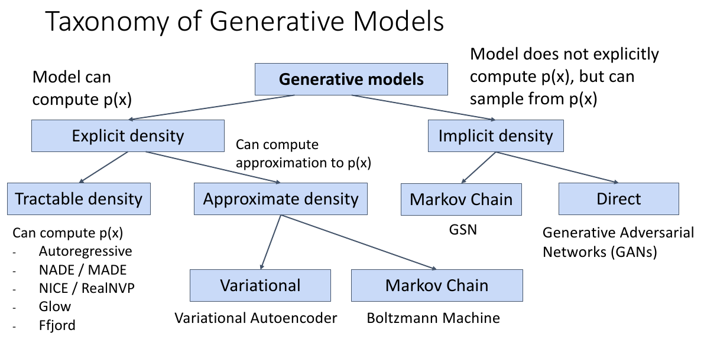
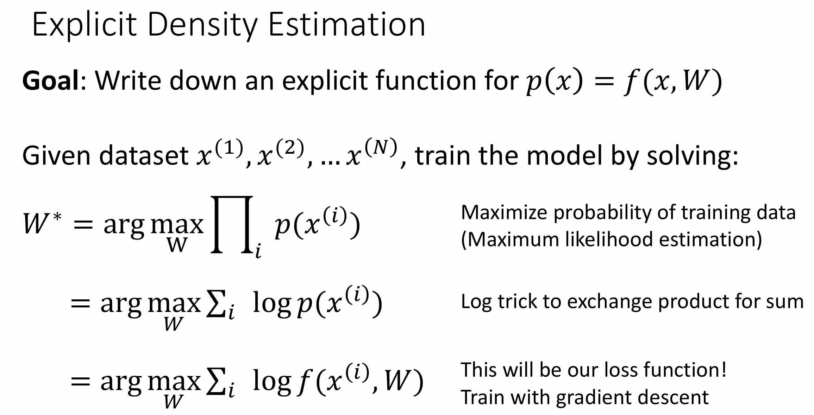
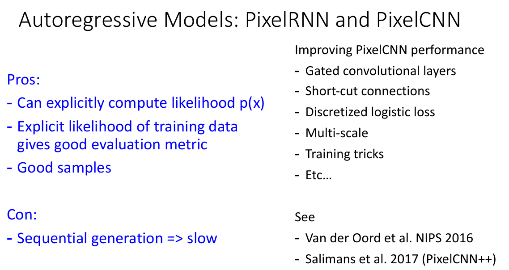
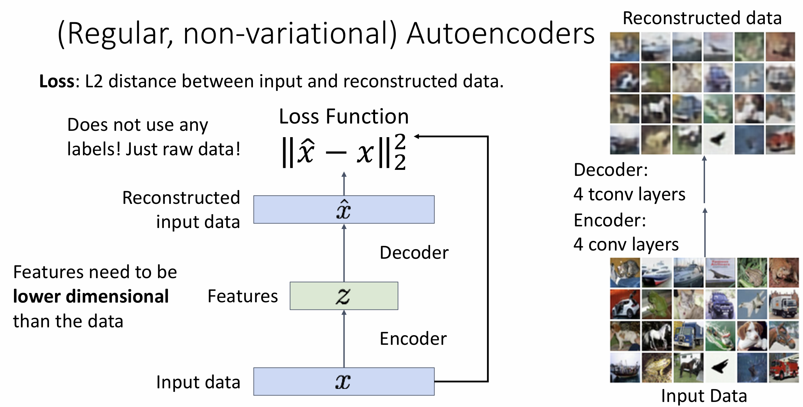
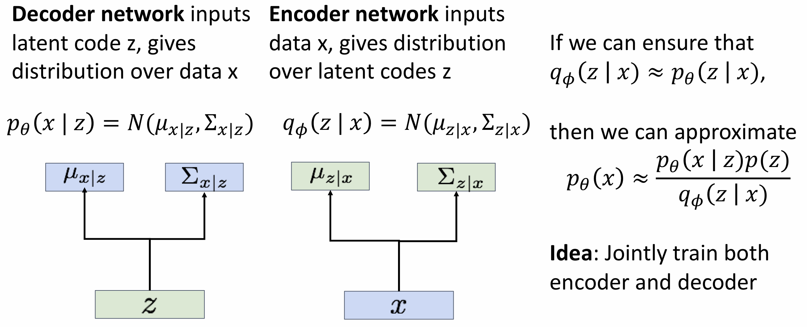
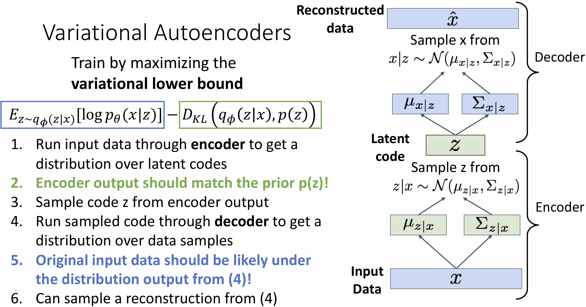
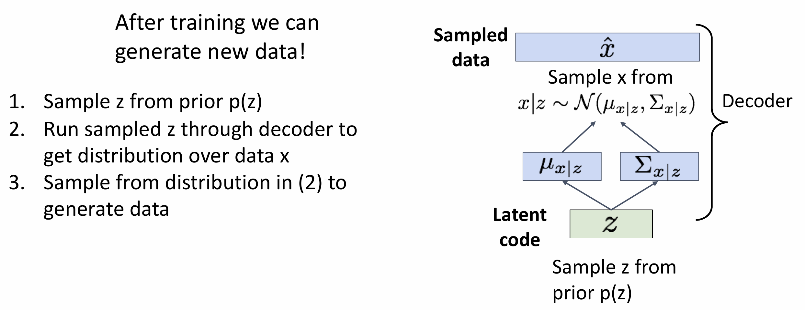
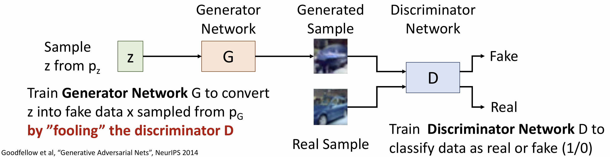
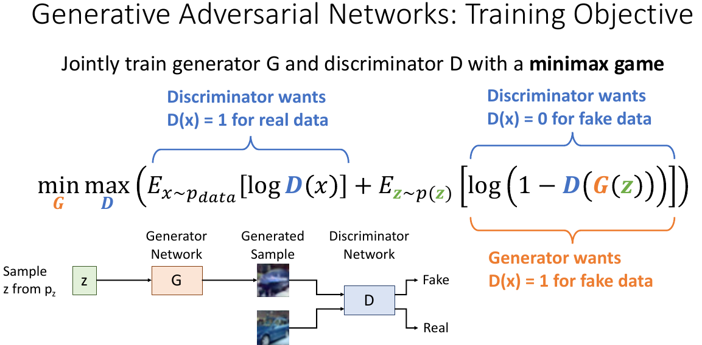
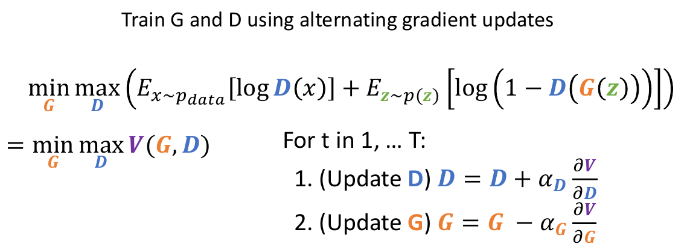

# 循环神经网络 (Recurrent Networks)

## 应用场景

之前 CNN 和 MLP 的输入和输出都只有一个,但实际问题中的输入和输出可能有多个。比如给图像加描述(one to many), 视频分类(many to one), 机器翻译(many to many),这些应用中可以使用循环神经网络。

当你处理的问题的输入**或**输出涉及到 _**序列**_ 时候，可以使用循环神经网络。

循环神经网络可以对**非序列型**的数据比如图片进行**序列化的处理**。

## 基础概念

我们可以通过在每一个时间步应用一个递推公式来处理一系列向量$x$。
其中使用相同的权重矩阵$W$和状态更新函数$f_W$就可以处理任意长的序列。

在序列被处理过程中，RNN 有一个一直更新的内部状态。

$$
h_{t}=f_{W} ( h_{t-1}, x_{t} )
$$

初始状态$h_0$被设置为全 0 或者通过学习得到。

## RNN 实现

### Vanilla RNN

一种 RNN 是"Vanilla RNN"。

$$
h_{t}=t a n h ( W_{h h} h_{t-1}+W_{x h} x_{t}+B_{h} )
$$

每一步的输出$y_t$通过另一个权重矩阵和隐藏状态计算得出。

$$
y_{t}=W_{h y} h_{t}+B_{y}
$$

Vanilla RNN 在反向传播中有两个问题：

1. 经过了 tanh 函数处理，不容易反向传播。
2. 在对矩阵乘法反向传播时候要乘矩阵的转置，并且要乘很多次。如果矩阵最大的奇异值大于一，梯度会爆炸。如果矩阵最大的奇异值小于一，梯度会消失。

### 长短期记忆（Long Short-Term Memory，LSTM）

长短期记忆相较于 Vanilla RNN，每步有两个状态：**单元状态**和**隐藏状态**。

LSTM 内有四个门：

-   f 遗忘门：是否清除单元状态
-   i 输入门：是否写入单元
-   g 候选门（或更新门）：写入单元的内容有多少
-   o 输出门：从单元中输出多少信息

通过这四个门可以计算出**单元状态**和**隐藏状态**。单元状态是 LSTM 的**内部**状态。输出门控制在隐藏状态中显示多少单元状态的信息。

LSTM 的计算图顶部有一条方便梯度传播的“高速公路”，类似于 Resnet 的设计，便于进行优化。

### 其他实现

还有一种 RNN 网络经常被使用，称为**门控循环单元**(Gated Recurrent Unit,GRU)。人们通过神经网络也预测出了很多其他 RNN 网络，但 LSTM 和 GRU 的表现通常不错。

## 截断式时间反向传播（truncated backpropagation through time）

循环神经网络是在时间上传播。在整个序列上执行前向传播以计算损失，然后在整个序列上执行反向传播以计算梯度。

然而，当我们需要训练非常长的序列时，这种方法会变得非常棘手。在实际应用中，人们通常采用一种近似方法，称为**截断式时间反向传播**（truncated backpropagation through time）。

这种方法的做法是：只在序列的若干小片段上进行前向和反向传播，而不是在整个序列上进行。

当我们处理下一段的数据时，仍然会保留来自前一段的隐藏状态，并将其传递下去。前向传播过程不会受到影响。在每一段的反向传播结束后，对权重进行一次梯度更新

## 语言模型

语言模型用来预测下一个字符输出什么。模型在每一步从概率分布中采样得到输出，并作为下一步的输入。

在自然语言处理（NLP）中，经常需要将离散的符号（如字母、词语）转换为计算机能处理的数值形式，最简单的方法是使用**独热编码**（One-hot encoding）。每个向量只有一个位置是 1，其他位置都是 0。

这些向量维度高且稀疏，当矩阵相乘时，效率很低。为了解决这些问题，可以引入**嵌入层**。将每个离散的符号（如一个字母）映射到一个低维稠密向量中，并通过训练学习这个映射。

## 多层 RNN

以上都是单层的 RNN，通过将一个 RNN 的隐藏状态作为输入传递给另一个 RNN，可以实现多层的 RNN。

## RNN 类型

### 一对多：

### 多对一：

### 多对多：

对于多对多的情况，我们在每一个时间步都计算一个$y_t$和对应的损失。最后，我们只需将所有时间步的损失相加，并将其作为整个网络的总损失。

### 序列到序列

对于机器翻译这种序列到序列(seq2seq)、(many to many)的问题，可以将一个编码器（encoder, many to one）和一个解码器(decoder,one to many)的 RNN 接起来, 它们有各自单独的权重。

编码器:处理输入数据 $[x_1, x_2, x_3, ...]$。整个输入序列的信息压缩到**上下文向量**(Context Vector)中，通常设为最后一个隐藏状态$h_T$。

解码器:$h_T$ 作为解码器的初始隐藏向量。 每一步的输出作为下一步的输入。第一步输入通常直接指定为 \<start\>。当 decoder 输出采样到\<end\>表示结束。

# 注意力机制

## RNN with attention

在之前[序列到序列](#序列到序列)的网络中，所有信息被压缩到**上下文向量**中，当输入比较长时候，这个向量不能够表示所有信息。可以将注意力机制用于这一模型,在每一步产生一个上下文向量。在每一步，解码器“注意”输入序列的不同部分。

计算过程如下：

1. 在每一步中，使用当前解码器状态$s_{t-1}$和每一个编码器的隐藏状态，计算出每个隐藏状态的对齐分数。可以用 MLP 计算。
2. 使用 softmax 得到概率分布，也就是注意力权重$a_{t,i}$。
3. 这一步的上下文变量 $c_{t}$ 是隐藏状态 $h_i$ 的线性组合 $c_t = \sum_i a_{t, i} h_i$。
4. 在编码器中使用这个上下文变量 $c_{t}$ 和输入计算出解码器下一个状态$s_{t}$

## CNN with attention

在利用 CNN 给图片加标注时候也可以使用注意力机制，每次看图片中不同的地方。
使用解码器当前状态和 CNN 得到的**特征图**也可以计算类似的对齐分数、注意力权重。

## 注意力层

可以将以上的注意力机制泛化，抽象出**注意力层**。

**query vectors** 是一系列的查询向量，是想要查找的东西。每个查询向量相当于之前解码器的一个隐藏状态。

**input vectors** 相当于原来编码器的所有隐藏状态。

之前使用$f_{att}$计算 query vectors 和 input vector 之间的相似性，但使用点乘效果就很好。

之后同样使用 softmax 函数计算出**注意力权重**后线性组合输入向量得到输出向量。

> **放缩**：实际计算相似性时通常要以因子$\sqrt{D_Q}$放缩防止梯度消失。因为点积的值随着向量维度的增加而变得越来越大。而后续经过 softmax 处理时，会产生几乎全是 0，只有一个接近 1 的分布。这会导致梯度变得非常小。

在整个过程中，输入向量有两个功能：

1. 与查询向量相乘得到相似分数。
2. 与注意力权重线性组合得到输出向量。

可以拆出两个新的向量组分别实现这两个功能。通常会将输出向量$X$与两个可学习权重矩阵$W_k$和$W_v$相乘得到 key vectors 和 value vectors 来 **分别** 完成功能 1 和功能 2 。

每个 Query 向量都会产生一个对应的输出向量。每个 Query 都在问“我该关注输入中的哪些部分？”，然后根据 Key/Value 得到一个“回答”——对应的输出向量。

### 自注意力层

以上的输入是两组向量 query vectors 和 input vectors。自注意力层中只有一组 input vectors。

自注意力层通过一个可学习的权重矩阵$W_Q$把 input vectors 转换为 query vectors。$W_k$和$W_v$矩阵和上面相同。

自注意力层输入一组向量，输出一组向量。但是自注意力层不知道向量间的顺序，以某种顺序互换输入向量，输出向量也会以同样顺序互换。

在某些场景中，为了能让自注意力层意识到向量间的顺序，会在输入向量中拼接 _**位置编码**_ 。

### 掩码自注意力层

在语言模型中，比如生成一段文字时候，模型应该只能使用过去的信息，不能提前查看后面的答案。

输出向量$Y_2$时只能使用输入向量$X_1$和$X_2$。可以通过调整注意力权重来遮盖后面的向量。

### 多头自注意力层

在实践中，多头自注意力层经常被使用。

对于一组输入向量，把这组向量在特征维度上拆分成$H$段，分别输入到$H$个独立的自注意力层中。每个**注意力头**会并行地处理信息，将输出的$H$组向量在特征维度上进行拼接，就可以得到最后的输出向量。

多头自注意力层的超参数包括模型总维度（输入/输出的向量总维度）和注意力头个数$H$。

## CNN with self-attention

可以使用 CNN 结合自注意力模块处理图像。

图像经过 CNN 处理生成**特征向量的网格**，将之视为之前的输入向量组可以得到**输出向量**。

通常会在最后加一个 1x1 的卷积并加入残差连接。

## 序列的处理方式

有三种处理序列的方式。

-   RNN
    -   优点：适合处理长序列。最后隐藏状态取决于整个序列。
    -   缺点：需要依次处理，不能够并行化处理。
-   一维卷积：每个输出元素是输入信号中一个局部区域与卷积核进行加权求和的结果。
    -   优点：易于并行化处理。
    -   缺点： 由于感受野的存在，需要多个卷积层单个输出才能看到整个输入序列。
-   自注意力机制
    -   优点：适合处理长序列（每个输出向量取决于**所有**输入向量）。易于并行化处理。
    -   缺点：需要大量 GPU 内存。

实际用神经网络处理序列时候，仅需要自注意力机制:Attention is all you need.通过 Transformer 来实现。

## The Transformer

### Transformer 块

Transformer 块的输入是一组向量，首先经过自注意力层处理（通常包含多个注意力头），在该过程中，所有向量相互**交互**，每个输出向量都会根据所有输入向量计算得出。自注意力层是 Transformer 块中**唯一**实现向量间交互的模块。

为了稳定训练过程并促进模型优化，自注意力层的输出会经过**残差连接**和**层归一化**。得到的向量随后输入至前馈神经网络（通常由两个全连接层和一个非线性激活函数组成），这一过程作用于每个向量**独立**进行，不涉及向量间的交互。

前馈层的输出同样通过**残差连接**与**层归一化**，形成该 Transformer 块的最终输出。

> 输出向量个数等于输入向量个数，但维度可能改变。

### 原始架构

Transformer 模型由一系列的 Transformer 块组成。

在论文[Attention is all you need](https://arxiv.org/abs/1706.03762)中编码器和解码器均由 6 个 Transformer 块构成，模型总维度为 512，自注意力层中有 6 个头。

**编码器**接收输入并建立其特征，它可以理解输入。**解码器**使用编码器输出的特征和其他的输入来生成目标序列，它用来产生输出。

左边灰色方框中的是编码器,右边的是解码器。

根据任务的不同，编码器和解码器可以独立使用。

-   纯编码器模型。适用于需要理解输入内容的任务，如句子分类和命名实体识别。
-   纯解码器模型。适合文本生成等生成任务。
-   编码器-解码器模型或序列-序列模型。适用于需要一个输入，然后生成一个输出的任务，如翻译或摘要。

### 语言模型

语言模型是现代自然语言处理(Natural Language Processing, NLP) 的核心。这些模型通过学习文本中 token 之间的关系来**理解**和**生成**人类语言。

Transformer 中的语言模型可以分为三类：

-   纯编码器模型。（如 BERT）。这些模型使用从两个方向理解上下文，适合需要深入理解文本的任务。
-   纯解码器模型（如 GPT、Llama）。这些模型从左到右处理文本，尤其擅长文本生成任务。
-   编码器-解码器模型（如 T5、BART）。它们擅长序列到序列的任务，

一般来说，需要双向上下文的任务使用编码器，生成文本的任务使用解码器，将一个序列转换为另一个序列的任务使用编码器-解码器。

### 计算机视觉

处理计算机视觉任务有两种方法：

1. 将图像分割成一系列小块，使用 Transformer 并行处理，如[Vision Transformer](https://arxiv.org/pdf/2010.11929)(ViT)
2. 使用现代 CNN，如 [ConvNeXT](https://arxiv.org/pdf/2201.03545)，它依赖卷积层，但采用现代网络设计。

ViT 和 ConvNeXT 通常用于图像分类，但对于其他视觉任务，如物体检测、分割和深度估计，我们将分别使用 DETR、Mask2Former 和 GLPN；这些模型更适合这些任务。

#### Vision Transformer

ViT 采用 Transformer**完全**替代了卷积。

在 ViT 的图片分类中，图片以如下的方式被输入。

1. 图像会被分割成不重叠的正方形小块，每个小块都会变成一个向量(embedding，嵌入)。就像文本被 tokenized（标记）为单词一样，图像也被 tokenized（标记）为一系列小块。
2. 在小块 embedding 的开头添加一个可学习的 embedding，一个特殊的 **[CLS]** 标记。 **[CLS]** 标记的最终隐藏状态作为分类头的输入，其他输出将被忽略。
3. 最后还要添加位置 embedding，因为模型不知道图像小块是如何排序的。位置嵌入也是可学习的，尺寸与小块嵌入相同。最后，所有的嵌入信息都会传递给变换器编码器。
4. 输出结果，特别是只有带有 **[CLS]** 标记的输出结果，会被传递给 MLP(多层感知器头)。MLP 将输出转换为类别标签的 logits ，并计算交叉熵损失，以找出最可能的类别。

# 网络可视化

CNN 中的第一层卷积层可以通过 RGB 图像可视化，它通常学习**边缘**、**颜色**信息。后续卷积层不好进行可视化，可以跳过中间的卷积层，使用最后的全连接层输出的特征向量来进行可视化。

原来对原始像素进行 KNN 分类效果很差，但是对特征向量进行 KNN 分类的话效果很好。红线右侧的图像与最左边的**查询图像**非常相近。

## 维度降低

人们很难理解高维的特征向量，因此可以使用算法在尽量保持高维结构的条件下，把向量维度降低。
线性的维度降低算法包括 **Principal Component Analysis(PCA)**

> PCA 的思想很直观, 假设我们要将 n 维特征映射到 k 维, 第一维选择原始数据中方差最大的维度, 第二维选取是与第一维正交的"平面"中方差最大的维度, 依次得到 k 维。

非线性的维度降低算法包括 t-SNE 算法

这里在对 10 个数字进行分类的问题中使用 t-SNE 算法把向量维度降低到二维的情况。图中包含 10 个区域的数字。

# 目标检测

在目标检测任务中，输入一张 RGB 图像, 输出一系列检测到的目标, 预测到的每个目标包含**标签**以及一个**边界框**(bounding box)。边界框朝向通常和图像一致。

目标检测任务需要更高分辨率的图像，通常是 3\*800\*600。

## 检测单个目标

检测单个目标比较简单，将图片经过 CNN 处理后，对特征向量分为两路处理。

一路可以使用 softmax loss 函数预测类别。另一路使用 l2 loss 预测边界框的位置。总的 loss 是两个 loss 函数的加权和。类似的这样一个模型完成多个任务，每个任务使用一个 loss 函数的情况叫做**multitask loss**

> Softmax Loss（通常指 Softmax + Cross-Entropy Loss）适用于分类任务。
>
> $$
> \mathrm{CrossEntropyLoss}=-\sum_{i=1}^{C} y_{i} \operatorname{l g} ( \hat{y}_{i} )
> $$
>
> 其中$y_i$是真实的 one-hot 标签， $\hat{y_i}
$是 softmax 输出的预测概率
>
> L2 Loss（又叫 Mean Squared Error，MSE）适用于回归任务。
>
> $$
> \mathrm{L 2 ~ Loss}=\frac{1} {n} \sum_{i=1}^{n} ( y_{i}-\hat{y}_{i} )^{2}
> $$

但是，图像中可能有多个目标。

## R-CNN

2014 年提出的[R-CNN](https://arxiv.org/abs/1311.2524)(Regions with CNN features)能够完成多目标检测的任务。

RCNN 中，首先通过**候选区域提取算法**（如 Selective Search）筛选出大概 2000 个可能包含目标的区域，再将这些区域裁剪为 224\*224 固定大小的图像。对于每个区域，单独使用 CNN 计算给出分类和边界框。

RCNN 输出边界框时候输出的是对原来候选区域的**变换**。变换后可以得到实际边界框。

> 衡量模型预测边界框和真实边界框的准确度使用交并比(Intersection over Union,IoU)。将边界框的交集(预测框与基准框)面积除以并集面积得到 IoU。
> 
> IoU > 0.5, 还行; IoU > 0.7, 挺好; IoU > 0.9, 几乎完美

在目标检测任务中，模型往往会在同一个目标的周围生成多个预测框（bounding boxes），可以通过**非极大值抑制**（Non-Maximum Suppression, NMS）处理。NMS 的核心目标是：在多个重叠框中，只保留得分最高的那一个，抑制其他重叠度高的框。但是，当图像中有很多很多重叠的目标时候，NMS 也无能为力。

## Fast R-CNN

R-CNN 会因为做 2000 个 CNN 而很慢, 我们可以通过交换**裁剪候选区域**和**CNN**的顺序, 共享一部分计算来提高效率。

在 Fast R-CNN 中图像先通过 CNN，提取整图的特征图，然后在特征图上提取每个候选区域的特征，通过在特征图上**裁剪候选区域**后（通过 RoI Pooling），每个区域通过一个相对**轻量**的 CNN 网络处理得到结果。。

比如用 Alex net 做 Fast R-CNN 时候，5 层卷积层被用作骨干网络。最后两层全连接网络被用作每个区域的网络。

> RoI Pooling（Region of Interest Pooling）是 Fast R-CNN 引入的一种关键操作，用来从特征图中提取出固定尺寸的候选区域特征，用于后续的分类和回归。

Fast R-CNN 的训练时间能做到 R-CNN 的 1/10, 测试时间为 1/40 左右, 但是大部分时间在算候补区域。作为深度学习的实践者，可以使用 CNN 来提出可能的候选区域。

## Faster R-CNN

Faster R-CNN 引入**区域候选网络**(Region Proposal Network,RPN)。

backbone network 输出特征图后，RPN 在特征图的每个点放置一个固定大小、固定长宽比的**锚框**(anchor box)。然后用另一个 CNN 判定这个锚框中**是否**包含对象。同时由于锚框可能与实际目标位置相差比较远，CNN 也会输出一个边界框**变换**得到最终的候选区域。

RPN classification 会联合训练 4 个损失函数

1. RPN classification
2. RPN regression
3. Object classification
4. Object regression

Faster R-CNN 是两阶段检测器。
第一阶段,Run once per image,到输出候选区域。第二阶段,Run once per region,对每个区域进行预测。
而单阶段检测器在 RPN 的锚框中直接对目标进行分类。

-   单阶段检测器：直接在输入图像上进行类别预测和边界框回归。
-   两阶段检测器：先通过 Region Proposal Network 找可能是目标的区域，再精细分类和回归。

## 模型评估

目标检测模型使用**平均精度**(mean Average Precision,mAP)来评估,计算流程如下：

1. 在所有测试图像上运行检测器。
2. 对于每个类别，计算平均精度（AP） ，也就是精度-召回率曲线下的面积。
    1. 对于每个检测结果（按得分从高到低排序）。如果它与某个真实框（GT）匹配，且 IoU > 0.5，否则将其标记为正例，并移除该真实框。
    2. 否则，将其标记为负例。
    3. 在精度-召回率曲线上绘制一个点。
3. mAP（mean Average Precision） = 所有类别 AP 的平均值。

> -   True Positive (TP)：预测为正, 实际为正(判断正确)
> -   True Negative (TN)：预测为负, 实际为负(判断正确)
> -   False Positive (FP)：预测为正, 实际为负(判断错误)
> -   False Negative (FN)：预测为负, 实际为正(判断错误)
>
> **准确率**:
>
> $$
> \mathrm{p}=\mathrm{p r e s i c i o n}={\frac{TP} {T P+F P}},
> $$
>
> 表示在所有预测中确实正确的比例。
>
> **召回率**:
>
> $$
> \mathrm{p}=\mathrm{p r e s i c i o n}={\frac{T P} {T P+F P}},
> $$
>
> 表示在所有真实标签中，我们 hit 到的比例。
>
> 如果让一个已经训练好的模型在测试集上运行一次, 准确度和召回率是确定的, 以横轴为 r, 纵轴为 p 可以画出 PR 曲线(累计形式)
> 
> 目标是获得同时具有高准确度和召回率的分类器, 在图形上的表现是曲线与坐标轴围成的区域面积尽可能大

# 生成模型

## 无监督学习

目前我们见到的模型都是属于**监督学习**的方式，它的目标是学习数据$x$到标签$y$的**函数映射**。数据集包含人们**手动**给数据添加的标签。
而**无监督学习**的目标是学习数据中的底层结构，它仅需要数据而**不需要**手工添加标签。
常见的无监督学习任务包括聚类、降维、特征分析(自编码器)、密度估计等。

生成模型可以用于解决无监督学习问题。

## 模型分类

有三种模型：判别模型、生成模型和条件生成模型，不同的模型可以用不同的概率论框架来解释。

-   判别模型是给定数据$x$，学习标签$y$的条件概率分布$P(y \mid x)$。它能够给数据贴标签，在有标签的情况下进行特征学习。
-   生成模型是对图像有了深入理解后，学习所有可能存在的图片出现的概率大小，用分布$p(x)$表示。它能够可以检测**离群值**（可以设置概率均低于某个阈值的数据为离群值）、在没有标签的情况下进行特征学习、采样生成新的数据。
-   条件生成模型是对于每个给定的标签$y$，学习所有可能存在的图片出现的概率大小，用分布$p(x \mid y)$表示。它能在标签$y$的条件下生成新的数据。

当输入不合理的图片时候，判别模型无法识别。但条件生成模型可以识别。通过贝叶斯公式可以将判别模型和生成模型组合得到条件生成模型。

生成式模型可以分为：

-   具有显式密度函数(能计算 $P(x)$)的模型
    -   可计算密度模型为数据提供了精确、可计算的概率密度。
    -   近似密度模型提供了估计或近似的概率密度，通常是因为精确计算是不可行的。
-   具有隐式密度函数(不能计算 $P(x)$, 但能从$P(x)$中采样)的模型

## 经典模型

### 自回归模型(Autogegressive Model)

自回归模型希望选择能够使得数据集中的数据可能性(likelihood)最大化的网络权重。

假设原始数据$x$由很多小部分(比如图片中的像素)组成

$$
x=( x_{1}, x_{2}, x_{3},..., x_{T} )
$$

概率密度函数可以写成一系列条件概率相乘

$$
p ( x )=p ( x_{1}, x_{2}, x_{3}, \ldots, x_{T} )=p ( x_{1} ) p ( x_{2} | x_{1} ) p ( x_{3} | x_{1}, x_{2} ) \cdots=\prod_{t=1}^{T} p ( x_{t} | x_{1}, \ldots, x_{t-1} )
$$

这样的形式可以用 RNN([PixelRNN](https://arxiv.org/abs/1601.06759))和卷积网络([PixelCNN](https://arxiv.org/abs/1606.05328))来实现。
但是自回归模型要对像素一一采样, 生成速度较慢。

### 变分自编码器(Variational Autoencoders, VAE)

#### 自编码器(Autoencoders)

变分自编码器是一种自编码器。自编码器是一种无监督学习方法, 旨在学习图像的**特征表示**。

我们希望通过输入$x$,训练得到**低维**特征$z$, 如果能从$z$中重建出输入$\hat{x}$, 说明特征$z$是有效的。
从$x \rightarrow z$的过程叫做 encode, 从 $z \rightarrow \hat{x}$的过程叫做 decode。
我们要训练两个神经网络 encoder 和 decoder, 结合起来就是自编码器, 这里的损失函数是$| | {\hat{x}}-x | |_{2}^{2}$。
$z$相对于$x$要是低维的, 否则就不能叫做特征了。

训练结束后, 我们就不需要 decoder 了, 而是使用 encoder 提取特征用于下游任务, 它是无监督的学习模型, 不能得到概率密度函数, 所以无法采样生成新图像。

#### 定义

变分自编码器是概率版本的自编码器，它同时能:

1. 从原始数据中学习潜在特征 z。
2. 从模型中采样以生成新数据。

在普通的 Autoencoder 中, $z$ 是一个确定的映射，这意味着对于每个输入 $x$，模型会输出一个单一的 $z$，这种方式无法表达潜在空间中的不确定性。Variational Autoencoder 不会输出一个确定的潜在表示，而是通过 Probabilistic Encoder 输出关于潜在表示的均值 $\mu$ 和标准差 $\sigma$，随后它会从正态分布中引入一个随机噪声 $\epsilon$ 来得到潜在表示 $z = \mu + \sigma \cdot \epsilon$。潜在表示 $z$ 随后被送入 Probabilistic Decoder 重建 $\hat x$ 并输出关于 $\hat x$ 的均值 $\mu$ 和标准差 $\sigma$。

> Probabilistic Encoder 和 Probabilistic Decoder 都是深度神经网络，它们和一般的 Encoder, Decoder 的区别在于它们输出的不是直接的潜在表示，而是关于潜在表示的均值 $\mu$ 和方差 $\sigma$。

VAE 编码器和解码器的输出都是概率分布，它的训练目标是最大化观测数据的对数似然$\operatorname{l o g} p_{\theta} ( x )$，也就是希望模型能够对数据集中的数据点赋予很高的概率。
根据贝叶斯公式

$$
p_{\theta} ( x )=\frac{p_{\theta} ( x | z ) p_{\theta} ( z )} {p_{\theta} ( z | x )}
$$

$p_{\theta} ( x \mid z )$用解码器来计算，$p_{\theta} ( z )$假设为某种简单的高斯先验分布，但是$p_{\theta} ( z | x )$没法计算，可以使用编码器网络来近似$q_{\phi} ( z | x ) \approx p_{\theta} ( z | x )$

经过复杂推导，数据的对数似然$\operatorname{l o g} p_{\theta} ( x )$可以表示为

$$
\begin{aligned}
\log p_{\theta}(x) &= \mathbb{E}_{z \sim q_{\phi}(z|x)} [\log p_{\theta}(x|z)] - D_{KL}(q_{\phi}(z|x) \| p_{\theta}(z)) \\
&\quad + D_{KL}(q_{\phi}(z|x) \| p_{\theta}(z|x)) \\
&\geq \mathbb{E}_{z \sim q_{\phi}(z|x)} [\log p_{\theta}(x|z)] - D_{KL}(q_{\phi}(z|x) \| p_{\theta}(z))
\end{aligned}
$$

最后一项没法算, 通过使得$q_{\phi} ( z | x ) \approx p_{\theta} ( z | x )$，直接把这一项扔掉，所以不能计算概率密度函数的精确值。但是通过最大化这个下界，也能最大化精确值。

VAE 的损失函数由两部分构成，Reconstruction Loss 和 KL Divergence Loss：

-   Reconstruction Loss: 由于 Probabilistic Decoder 输出的也是均值 $\hat\mu$ 和误差 $\hat \sigma$，可以通过 $\hat x = \hat \mu + \hat \sigma \cdot \hat \epsilon$ 得到 $\hat x$ ($\hat \epsilon$ 来自正态分布)，进而得到 Reconstruction Loss $loss_{recon} = ||x - \hat x||^2$
-   KL Divergence Loss: $loss_{KL} = \frac{1}{2} \sum i(1 + log \sigma_i^2 - \mu_i^2 - \sigma_i^2)$，用于保证潜在空间的结构合理，保障 VAE 的生成能力

最终的损失函数: $loss_{VAE} = loss_{recon} + \beta loss_{KL}$, $\beta$ 用于调节两者之间的权重。

#### 网络训练与测试

训练时：
先取一个 batch 的输入 x, 跑 encoder 网络后会得到符合隐变量 z 的分布, 用这个分布来算$D_{K L} ( q_{\phi} ( z | x ), p_{\theta} ( z ) )$

然后从预测分布中采样获得 z, 输入到 decoder, 希望采样获得$\hat x$(数据重建), 并计算$E_{z \sim q_{\phi} ( z | x )} [ \log p_{\theta} ( x | z ) ]$

图中蓝色和绿色的部分相互矛盾, 蓝色希望选择 z 使得$\hat x$更接近原始数据, 而绿色部分希望限制 z 满足某种高斯分布。

测试时只需要解码器：

VAE 的优点是快速, 有丰富的隐变量 z, 缺点是生成的图像有点模糊。

### 生成对抗网络(Generative Adversarial Networks, GAN)

生成对抗网络完全放弃显式建模密度函数, 只关心采样。

假设数据$x_i$来自分布$p_{data} ( x )$, 我们想要训练一个模型可以从$p_{data}$中采样。
我们引入隐变量$z$, 假设其有先验分布$p_{z}$, 我们采样一些$z$, 将它们传入生成网络$G$中, 使得$x=G ( z )$。

$x$来自分布$p_{G}$，目标是通过训练努力实现$p_{G} = p_{data}$

为了达到这个目标, 我们引入第二个网络——判别器网络(discriminator network), 记作$D$, 它接收来自生成器的样本以及来自数据集的真实样本进行分辨。生成器通过训练来欺骗判别器, 这就是"对抗"。
如果两个网络都会良好工作, 我们希望$p_{G}$会收敛到$p_{data}$

目标函数为：

$$
\underset{G} {\operatorname* {m i n}} \underset{D} {\operatorname* {m a x}} ( E_{X \sim p_{d a t a}} [ \operatorname{l o g} D ( x ) ]+E_{z \sim p ( z )} [ \operatorname{l o g} ( 1-D ( G ( z ) ) ) ] )
$$

我们用 1/0 表示数据为 真实/虚假生产 的,$D$想要使真实数据$D(x)$输出 1 并且错误数据$D(G(z))$输出 0。
两个网络的训练相对复杂，训练时候交替对梯度进行更新。

GAN 网络热度很高，有很多改进的论文。
