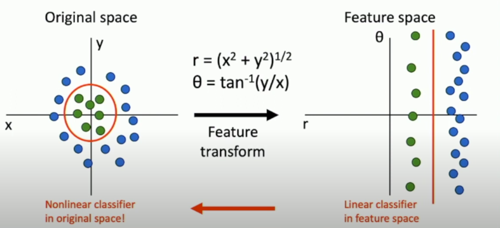
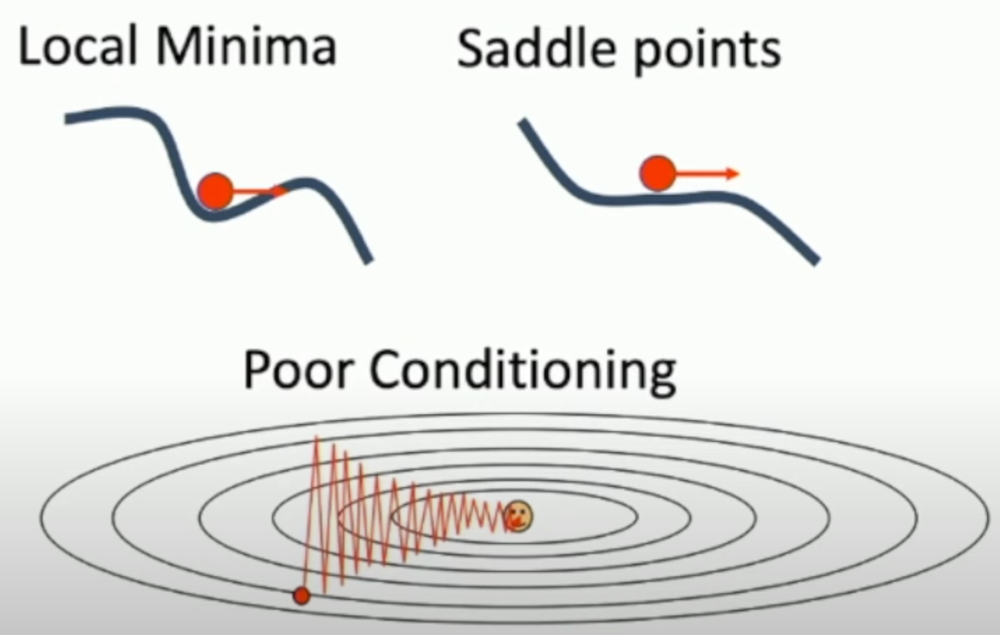
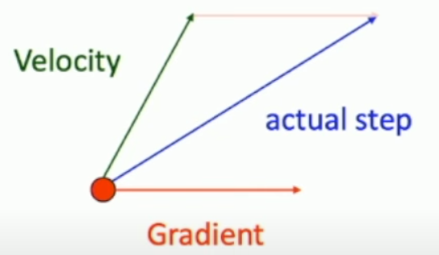
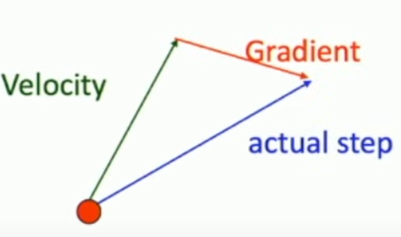
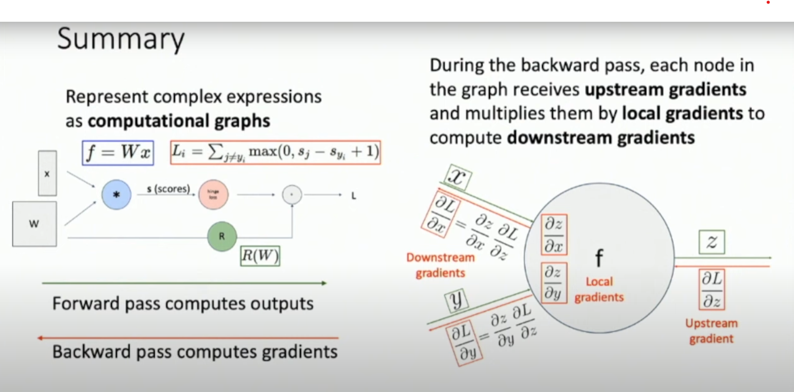

# 线性分类器（Linear Classifiers）

线性分类器的缺点


解决方法之一：**特征变换**


## 损失函数

损失函数定量描述模型的好坏，它代表了我们对于模型中参数的偏好。可能有两组参数的损失值相同，仅由数据计算而来的损失函数会认为两者相同。可以在损失函数中加入正则项来体现出人类的先验的对参数的偏好。

# 优化（Optimization）

$$
w^{*}=\operatorname{a r g} \operatorname* {m i n}_{w} L ( w )
$$

## SGD

对 gradient descent 进行 Stochastic 处理，每次迭代时候抽取一批样本而不是用全部样本用于参数更新来降低算力要求。

$$
x_{t+1}=x_{t}-\alpha\nabla f ( x_{t} )
$$

```python
for t in range(num_steps):
    dw = compute_gradient(w)
    w -= learning_rate * dw
```

### 问题



## SGD with Momentum

SGD with Momentum 是为了克服 SGD 在收敛的过程中可能会停在 **局部最小值** 或者 **鞍点** 的问题，在这些点处梯度为 0，参数无法继续更新。

通过给 SGD 一个速度，从而越过**局部最小值** 或者 **鞍点** 可以解决这些问题。



$$
\begin{aligned}
v_{t+1} &= \rho v_{t} + \nabla f ( x_{t} ) \\
x_{t+1} &= x_{t} - \alpha v_{t+1}
\end{aligned}
$$

```python
v = 0
for t in range(num_steps):
    dw = compute_gradient(w)
    v = rho * v + dw
    w -= learning_rate * v
```

Build up "velocity" as a running mean of gradients. Rho gives"friction";typically rho=0.9 or 0.99

等价于

$$
\begin{aligned}
  v_{t+1} &= \rho v_{t}-\alpha\nabla f ( x_{t} ) \\
  x_{t+1} &= x_{t}+v_{t+1}
\end{aligned}
$$

```python
v = 0  # 初始化动量项
for t in range(num_steps):  # 迭代 num_steps 次
    dw = compute_gradient(w)  # 计算当前权重 w 的梯度
    v = rho * v - learning_rate * dw  # 计算新的动量值
    w += v  # 更新权重
```

## Nesterov Momentum

根据速度向量到达新的点后计算梯度，对这个梯度和原来的速度进行向量和，作为原来的点更新使用的梯度。


$$
\begin{array} {l} {v_{t+1}=\rho v_{t}-\alpha\nabla f ( x_{t}+\rho v_{t} )} \\ {x_{t+1}=x_{t}+v_{t+1}} \\ \end{array}
$$

```python
V = 0  # 初始化动量
for t in range(num_steps):
    dw = compute_gradient(w)  # 计算梯度
    old_v = V  # 记录旧的动量
    V = rho * V - learning_rate * dw  # 更新动量
    w -= rho * old_v - (1 + rho) * V  # 更新权重
```

## AdaGrad 算法（Adaptive Gradient Algorithm）

沿着“陡峭”方向的进展受到抑制，而沿着“平坦”方向的进展被加速。

```python
grad_squared = 0  # 初始化梯度累积项
for t in range(num_steps):
    dw = compute_gradient(w)  # 计算梯度
    grad_squared += dw * dw  # 累积梯度平方
    w -= learning_rate * dw / (grad_squared.sqrt() + 1e-7)  # 进行参数更新，避免除零

```

问题：grad_squared 可能会在到达损失函数最低点过大，而使得参数停止更新。
解决方法：**RMSProp**。

## RMSProp

与 AdaGrad 算法相比增加了一个“摩擦”项。

```python
grad_squared = 0  # 初始化累积梯度平方项
for t in range(num_steps):
    dw = compute_gradient(w)  # 计算梯度
    grad_squared = decay_rate * grad_squared + (1 - decay_rate) * dw * dw  # 计算加权移动平均
    w -= learning_rate * dw / (grad_squared.sqrt() + 1e-7)  # 更新参数

```

## Adam 算法

结合两个好的 idea: SGD with Momentum + RMSProp = Adam
但是刚开始的时候梯度可能过大。
优化：**偏差修正**。

```python
moment1 = 0  # 一阶矩估计（动量项）
moment2 = 0  # 二阶矩估计（梯度平方的指数加权平均）

for t in range(num_steps):
    dw = compute_gradient(w)  # 计算梯度

    # 计算一阶矩估计（动量）
    moment1 = beta1 * moment1 + (1 - beta1) * dw

    # 计算二阶矩估计（梯度平方的移动平均）
    moment2 = beta2 * moment2 + (1 - beta2) * dw * dw

    # 计算一阶和二阶矩的偏差修正
    moment1_unbias = moment1 / (1 - beta1 ** t)
    moment2_unbias = moment2 / (1 - beta2 ** t)

    # 更新参数
    w -= learning_rate * moment1_unbias / (moment2_unbias.sqrt() + 1e-7)

```

### 经验

> Adam with beta1 = 0.9
> beta2 = 0.999, and learning rate = 1e-3, 5e-4, 1e-4 is a great starting point for many models!

# 神经网络

## 特征变换

通过对原始的输入特征进行变换，可能就能够处理原来的模型所不能处理的问题。对于图像分类而言，常用的特征变换包括：

-   Color Histogram 色彩直方图
-   Histogram of Oriented Gradients (HoG) 方向梯度直方图 (HoG)
-   Bag of Words 词袋模型 **_数据驱动的_**

不同的特征变换可以组合在一起使用。


## 端到端的学习

先进行特征提取再利用模型在提取出的特征上对图像进行分类时候，只会调整模型的参数，而特征提取的部分可能不会提高图片的分类效果。
因此，更好的办法是端到端的学习，输入原始数据，输出想要的结果。中间整体地对特征提取和特征处理部分进行训练来提高图像分类效果。

## 基础概念

深度神经网络的层数通常是指网络所含权重矩阵的个数。
宽度是隐藏表示的纬度。隐藏表示的纬度通常是一样的。
激活函数可以看成两个权重矩阵之间的“三明治”，给予网络额外的表现能力。

激活函数有多种。


通常应该使用某种可调正则化参数的神经网络模型，而不是直接依赖网络本身的大小作为正则化因子。
网络大小不一定是最优正则化方式：虽然较大的网络可能更容易过拟合，但仅仅减少参数数量并不总是最佳策略。

## 反向传播


pytorch 中模型的计算步骤存储在**计算图**中，每个节点代表一次运算。
反向传播中，对于计算图中每个节点来说 downstream gradient = upstream gradient \* local gradient

# 卷积网络

卷积网络中的权重矩阵一般称为 **卷积核** 或者 **filter**，它的深度一般和输入张量的深度一致，比如说 3。
输入张量和卷积核卷积后的结果被称为 **activation map**。
一层卷积层可以有多个卷积核，这是一个 可以设置的超参数。


有两种方式看待卷积后的结果：

1. 一系列的 feature map 的集合。
2. 特征向量组成的网格。

通常对一批图像进行处理。


> 一般可以对第一层的参数可视化进行解释。

## 步幅和填充

padding: 在图片周围填充来防止图片尺寸缩小
特例：**same padding**后图像的大小不会改变


stride:下采样，防止网络需要很多层卷积才能获取到输入图片的全局信息。
除了 conv 中的 stride 可以下采样，池化层也可以下采样。

卷积通常的参数设置：


## 全连接层和 1x1 卷积的区别

全连接层可以用来破坏空间结构，比如网络最后一层生成分数。
1x1 卷积用来调节通道深度。

## 归一化

问题：网络很难训练。解决方法：归一化
通常使用 **批量归一化** ，使得每一层的输出符合均值为 0，方差为 1 的分布。
批量归一化训练和推理时行为不一致。
训练时：

推理时：


**批量归一化** 中一个批次的样本之间相互影响，**层归一化**可以避免这一问题。

## VGG net

两个 3x3 的卷积比单个 5x5 的卷积在参数、浮点计算更低的情况下效果可能会更好。
用卷积 stage 替换卷积层。每个 stage 里有多个卷积。
通过减半空间大小和把通道数翻倍，保持每个卷积 stage 中浮点计算次数差不多。

> 下采样：任何能够减少输入的空间尺寸的操作

在实际应用中，不应该自己设计新的网络架构，而是应该在现有好的网络基础上修改。

