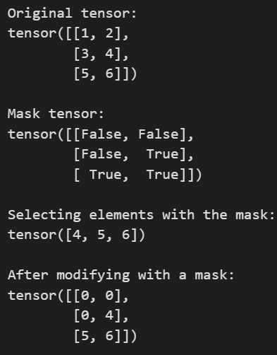

# 定义

张量(tensor)是一组具有多维度结构的数。维度的个数称为 **阶**(rank),通过`tensor.dim()查看`。张量的具体形状通过`tensor.shape()`查看。

# 索引方式

## 切片索引

像 python 的 list 和 numpy 的 array 一样，张量可以通过切片索引。PyTorch 张量可以使用 `start:stop` 或 `start:stop:step` 这样的语法进行切片。stop 总是不被包括在内的第一个元素。

```python
a = torch.tensor([0, 11, 22, 33, 44, 55, 66])
print(0, a)        # (0) Original tensor
print(1, a[2:5])   # (1) Elements between index 2 and 5
print(2, a[2:])    # (2) Elements after index 2
print(3, a[:5])    # (3) Elements before index 5
print(4, a[:])     # (4) All elements
print(5, a[1:5:2]) # (5) Every second element between indices 1 and 5
print(6, a[:-1])   # (6) All but the last element
print(7, a[-4::2]) # (7) Every second element, starting from the fourth-last
```

访问张量中的单行或单列有两种常见方法：

-   使用一个整数索引会使张量的阶（rank）减少 1；
-   使用一个长度为 1 的切片（slice）则保持张量的阶不变。

```python
a = torch.tensor([[1,2,3,4], [5,6,7,8], [9,10,11,12]])
row_r1 = a[1, :]    # Rank 1 view of the second row of a      tensor([5, 6, 7, 8]) torch.Size([4])
row_r2 = a[1:2, :]  # Rank 2 view of the second row of a      tensor([[5, 6, 7, 8]]) torch.Size([1, 4])
```

## 整数张量索引

整数索引可以互换张量行和列的顺序。

```python
a = torch.tensor([[1, 2, 3, 4], [5, 6, 7, 8], [9, 10, 11, 12]])


# Create a new tensor of shape (5, 4) by reordering rows from a:
# - First two rows same as the first row of a
# - Third row is the same as the last row of a
# - Fourth and fifth rows are the same as the second row from a
idx = [0, 0, 2, 1, 1]  # index arrays can be Python lists of integers
print(a[idx])

# Create a new tensor of shape (3, 4) by reversing the columns from a
idx = torch.tensor([3, 2, 1, 0])  # Index arrays can be int64 torch tensors
print(a[:, idx])
```

更一般地说，给定两个索引数组 idx0 和 idx1，它们各自有 N 个元素，
那么表达式 a[idx0, idx1] 等价于：

```
torch.tensor([
  a[idx0[0], idx1[0]],
  a[idx0[1], idx1[1]],
  ...,
  a[idx0[N - 1], idx1[N - 1]]
])
```

## 布尔张量索引

布尔张量索引允许你根据一个布尔掩码（boolean mask）选取张量中任意的元素。

```python
a = torch.tensor([[1,2], [3, 4], [5, 6]])
# Find the elements of a that are bigger than 3. The mask has the same shape as
# a, where each element of mask tells whether the corresponding element of a
# is greater than three.
mask = (a > 3)
# We can use the mask to construct a rank-1 tensor containing the elements of a
# that are selected by the mask
print(a[mask])
# We can also use boolean masks to modify tensors; for example this sets all
# elements <= 3 to zero:
a[a <= 3] = 0
print(a)
```



# 张量操作

## 按元素操作

基本的数学函数在张量上是按元素（elementwise）操作的，可以通过运算符重载,torch 模块中的函数，以及张量对象的方法来使用。

```python
x = torch.tensor([[1, 2, 3, 4]], dtype=torch.float32)
y = torch.tensor([[5, 6, 7, 8]], dtype=torch.float32)

# Elementwise sum; all give the same result
print('Elementwise sum:')
print(x + y)
print(torch.add(x, y))
print(x.add(y))

x = torch.tensor([[1, 2, 3, 4]], dtype=torch.float32)
print(torch.sqrt(x))
print(x.sqrt())

print(torch.sin(x))
print(x.sin())
print(torch.cos(x))
print(x.cos())
```

# 广播

广播（Broadcasting）是一种强大的机制，它允许 PyTorch 在执行算术运算时处理形状不同的数组。

将两个张量进行广播（broadcasting）时，遵循以下规则：

1. 如果两个张量的阶（rank）不同，先在较低阶张量的形状（shape）**前面**补 1，直到两个形状长度相同。

2. 如果在某个维度上，两者的大小相同，或者其中一个张量在该维度上的大小为 1，那么这两个张量在这个维度上被认为是**兼容**的。

3. 只有当两个张量在**所有**维度上都兼容时，它们才能进行广播。

4. 广播之后，每个张量的行为就好像它的形状是两个输入张量形状在各个维度上取元素最大值的结果。

5. 在任何一个维度上，如果一个张量的大小是 1，另一个张量的大小大于 1，那么这个大小为 1 的张量在该维度上表现得像是被复制了一样。
